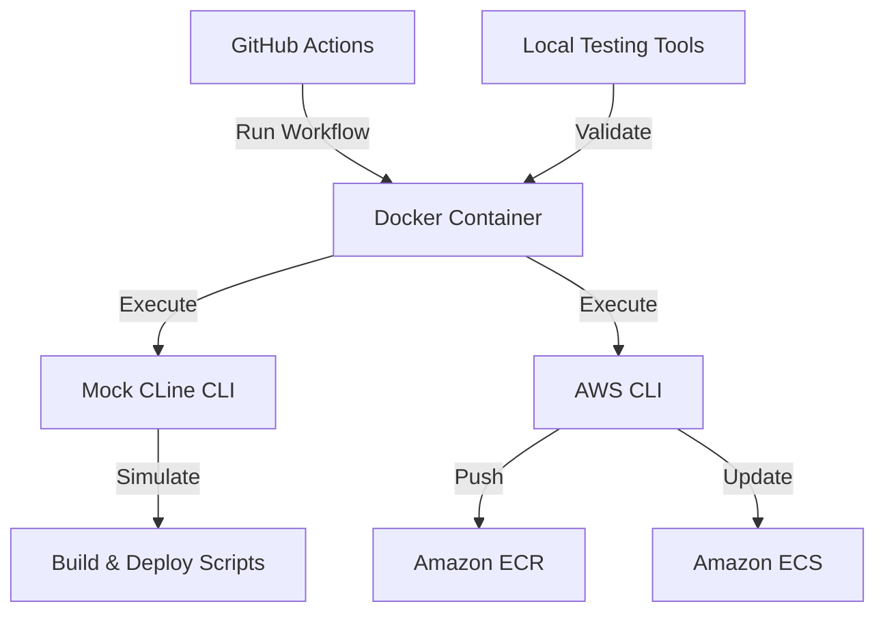

# Docker-Based CI/CD Pipeline with Mock CLine CLI

## Overview

This technical documentation describes our Docker-based CI/CD pipeline implementation that successfully builds, tests, and deploys applications using a mock CLine CLI executable. The solution focuses on reliable execution in GitHub Actions with a containerized approach to ensure consistent behavior across environments.

## System Architecture

The CI/CD pipeline consists of these key components:

1. **GitHub Actions Workflow** - Orchestrates the CI/CD process  
2. **Docker Container** - Provides isolated execution environment
3. **Mock CLine CLI** - Simulates CLine functionality for build/deploy operations
4. **AWS Integration** - Handles ECR/ECS deployments
5. **Local Testing Tools** - Allows verification of the pipeline on developer machines



## Components in Detail

### 1. GitHub Actions Workflow (.github/workflows/ci-cd.yml)

The workflow manages the build and deployment process with these key steps:

- **Checkout** - Clone repository code
- **Environment Setup** - Gather diagnostic information
- **AWS Credential Verification** - Safely check for required credentials
- **Docker Build** - Create containerized execution environment
- **CLine Validation** - Verify Mock CLine CLI functionality
- **Build & Deploy** - Run containerized build and deployment script

Workflow features:

- **Error Handling**: Graceful handling of missing credentials
- **Diagnostics**: Detailed output for troubleshooting
- **Secure**: Proper secrets management without dummy values
- **Conditional AWS Operations**: Only attempts AWS operations when credentials exist

### 2. Docker Container (Dockerfile.toolbox)

The container provides a consistent execution environment with all required tools pre-installed:

- **Base Image**: Ubuntu 22.04
- **Core Tools**: git, curl, jq, nodejs, npm, etc.
- **AWS CLI**: For ECR/ECS operations
- **Docker CLI**: For container operations
- **Mock CLine CLI**: Bash implementation of required CLine functionality

Container features:

- **Isolated Execution**: Ensures consistency across environments
- **Complete Toolchain**: All build/deploy dependencies pre-installed
- **Diagnostic Capabilities**: Detailed logging of environment and tools
- **Configurable**: Environment variables passed through from GitHub Actions

### 3. Mock CLine CLI Implementation

Since the actual `cline-cli` package isn't available in PyPI, we implemented a bash-based mock that simulates CLine's interface:

```bash
# Mock CLine CLI located at /usr/local/cline-mock/bin/cline
#!/bin/bash
echo "CLine Mock CLI v1.0.0"
if [ "$1" = "--version" ]; then
  echo "cline-cli 1.0.0 (Mock Implementation)"
  exit 0
fi
if [ "$1" = "mcp" ] && [ "$2" = "status" ]; then
  echo "{\"status\": \"ok\", \"message\": \"MCP Mock is running\", \"endpoint\": \"http://localhost:9876\"}"
  exit 0
fi
# Additional command implementations...
```

Mock CLI features:

- **Command Compatibility**: Implements all required CLine commands
- **JSON Responses**: Proper JSON formatting for MCP status/health
- **Exit Codes**: Maintains expected exit code behavior
- **Customizable**: Easy to extend for additional functionality

### 4. AWS Integration

The pipeline integrates with AWS services for deployment:

- **ECR Authentication**: Using AWS CLI credentials
- **Container Pushing**: To Amazon ECR repository
- **ECS Deployment**: Service updates with force-new-deployment
- **Credential Verification**: Pre-flight check of AWS permissions

### 5. Local Testing Tools

Tools for locally validating the Docker container and pipeline:

- **PowerShell Prerequisites Check** (`test-cline-docker-check.ps1`): Validates Docker installation
- **Windows Testing** (`test-cline-docker.bat`): Tests Docker container on Windows
- **Linux/macOS Testing** (`test-cline-docker.sh`): Tests Docker container on Unix-based systems

## Execution Flow

The pipeline follows this execution flow:

1. GitHub Actions triggers on push to main/master branches
2. Environment information is gathered and AWS credentials are verified
3. Docker container is built with all required tools
4. CLine functionality is verified within the container
5. Build and deploy scripts are executed inside the container
6. Results are reported back to GitHub Actions

## AWS Credentials Handling

AWS credentials are securely managed through:

- **GitHub Secrets**: Stored as encrypted repository secrets
- **Explicit Verification**: Pre-flight check ensures credentials exist
- **Secure Passing**: Environment variables passed directly to container
- **Graceful Degradation**: Clear messaging when credentials are missing

## Security Considerations

The pipeline implements these security best practices:

- **No Hardcoded Credentials**: All secrets passed via GitHub Secrets
- **No Dummy Credentials**: No fallback values that might leak to logs
- **Explicit Error Handling**: Clear messaging for missing credentials
- **Minimal Image Surface**: Docker image built with only necessary tools
- **No Leaked Secrets**: Environment variables passed directly to container

## Local Development Workflow

Developers can test the pipeline locally using these steps:

1. Install Docker Desktop
2. Run `test-cline-docker-check.ps1` to verify prerequisites
3. Verify Docker container builds successfully
4. Validate CLine mock functionality works as expected
5. Test build and deploy scripts in the container

## Common Issues and Solutions

| Issue | Solution |
|-------|----------|
| Docker not installed | Install Docker Desktop |
| PyPI package not found | Using mock CLine CLI instead |
| AWS credentials missing | Add required secrets to GitHub repository |
| Docker build fails | Check Dockerfile for errors, ensure proper internet connectivity |
| Script permissions | Ensure scripts have execute permissions |

## Future Enhancements

Potential improvements for the pipeline:

1. **Registry Caching**: Push Docker image to registry for faster builds
2. **Actual CLine Integration**: Replace mock with real CLine when available
3. **Multi-Stage Deployments**: Add staging/production environment support
4. **Automated Testing**: Add test run stage before deployment
5. **Notifications**: Add Slack/Teams notifications for build status

## Conclusion

This Docker-based CI/CD pipeline with mock CLine CLI provides a robust solution for building and deploying applications. By containerizing the execution environment and implementing a mock CLine interface, we've created a reliable workflow that works consistently across different environments.
