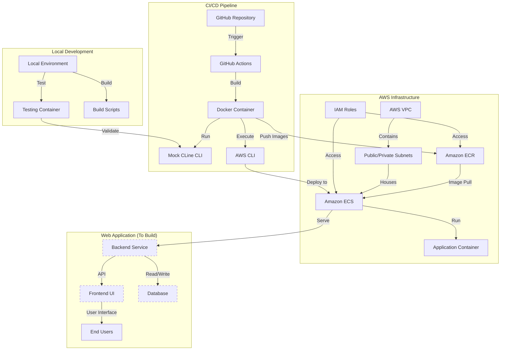

# Current Architecture and Next Steps for Web Application Development

## Current Architecture



## Current Architecture Details

Your current architecture consists of these key components:

### CI/CD Pipeline
- **GitHub Repository**: Stores your application code and infrastructure configuration
- **GitHub Actions**: Configured workflow (.github/workflows/ci-cd.yml) to automate builds and deployments
- **Docker Container**: Custom environment (Dockerfile.toolbox) with all necessary build tools
- **Mock CLine CLI**: Bash-based implementation that simulates CLine functionality
- **AWS CLI**: For ECR/ECS operations during deployment

### AWS Infrastructure
- **ECR Repository**: Stores Docker images for deployment
- **ECS Service**: Runs containerized applications
- **VPC & Subnets**: Network infrastructure for secure deployment
- **IAM Roles**: Access control for AWS resources

### Local Development
- **Testing Scripts**: Tools for validating Docker setup (test-cline-docker.bat/.sh)
- **Build Scripts**: Local execution of build/deploy processes
- **Docker Desktop**: Required for local container testing

## Next Steps for Web Application Development

Now that your CI/CD pipeline is working correctly, you can focus on building your actual web application. Here's a step-by-step plan:

### 1. Choose Your Technology Stack

Based on your repository structure, it appears you're setting up a Node.js backend. You'll need to decide on:

- **Backend Framework**: Express.js (looks like you've started with this in backend/app.js)
- **Frontend Framework**: React, Vue, Angular, or plain JavaScript
- **Database**: SQL (PostgreSQL, MySQL) or NoSQL (MongoDB, DynamoDB)
- **API Pattern**: REST or GraphQL

### 2. Set Up Backend Application

You have a backend directory that appears to be a Node.js application. Next steps:

1. **Complete package.json**: Update with all required dependencies
   ```bash
   cd backend
   # If starting fresh:
   npm init
   
   # Add core dependencies
   npm install express cors body-parser
   
   # Add development dependencies
   npm install --save-dev nodemon eslint
   ```

2. **Create API Structure**:
   - Define routes in separate files
   - Set up middleware for authentication, logging, etc.
   - Create controller logic for handling requests
   - Add a data access layer for database operations

3. **Database Integration**:
   - Choose a database provider compatible with AWS
   - Set up connection configuration in .env files
   - Create database models/schemas
   - Implement data access methods

4. **Containerize the Backend**:
   - Update backend/Dockerfile with appropriate Node.js base image
   - Configure proper environment variables
   - Set up the application start command

### 3. Create Frontend Application

You'll need to create a frontend application that communicates with your backend API:

1. **Initialize Frontend Project**:
   ```bash
   # For React
   npx create-react-app frontend
   
   # For Vue
   npm create vue@latest
   
   # For Angular
   ng new frontend
   ```

2. **Structure the Application**:
   - Set up routing (React Router/Vue Router/Angular Router)
   - Create component hierarchy
   - Implement state management (Redux/Vuex/NgRx)
   - Design API service layer to communicate with backend

3. **Containerize the Frontend**:
   - Create a Dockerfile specific to frontend needs
   - Configure for production builds
   - Set up environment-specific configurations

### 4. Update CI/CD Pipeline for Web Application

Adjust your current CI/CD workflow to build and deploy both frontend and backend:

1. **Update build_and_deploy.sh**:
   - Add steps to build frontend
   - Add steps to build backend
   - Create separate container images for each

2. **Adjust GitHub Actions**:
   - Update the workflow to handle multiple containers
   - Add environment-specific deployment steps

3. **Configure AWS Resources**:
   - Create ECS task definitions for each service
   - Set up load balancer if needed
   - Configure service discovery for inter-service communication

### 5. Local Development Workflow

Establish an efficient local development process:

1. **Create docker-compose.yml for Local Development**:
   ```yaml
   version: '3'
   services:
     frontend:
       build: ./frontend
       ports:
         - "3000:3000"
       volumes:
         - ./frontend:/app
       environment:
         - NODE_ENV=development
         
     backend:
       build: ./backend
       ports:
         - "8080:8080"
       volumes:
         - ./backend:/app
       environment:
         - NODE_ENV=development
       depends_on:
         - db
         
     db:
       image: postgres:14
       volumes:
         - pgdata:/var/lib/postgresql/data
       environment:
         - POSTGRES_PASSWORD=devpassword
         - POSTGRES_USER=devuser
         - POSTGRES_DB=devdb
   
   volumes:
     pgdata:
   ```

2. **Create Development Scripts**:
   - Add npm scripts for common operations
   - Create convenience scripts for environment setup

### 6. Testing Strategy

Implement comprehensive testing:

1. **Unit Testing**:
   - Set up Jest/Mocha for backend tests
   - Configure testing framework for frontend
   
2. **Integration Testing**:
   - Create API tests with Supertest or similar
   - Set up end-to-end tests with Cypress or Playwright

3. **Add Test Stage to CI/CD**:
   - Update GitHub Actions to run tests
   - Configure test reporting

### 7. Deployment and Infrastructure

Expand your AWS infrastructure for the complete application:

1. **Database Setup**:
   - Create RDS instance or DynamoDB tables
   - Configure security groups and access policies
   
2. **Networking**:
   - Set up public/private subnets
   - Configure load balancers and security groups
   
3. **Monitoring**:
   - Implement CloudWatch logging
   - Set up alerting and dashboards

## Getting Started Today

To start building your web application immediately:

1. **Initialize/Complete Backend**:
   ```bash
   cd backend
   npm install
   # Create basic API endpoints
   ```

2. **Create Frontend**:
   ```bash
   # From project root
   npx create-react-app frontend
   cd frontend
   npm start
   ```

3. **Run Local Development Environment**:
   ```bash
   # Create docker-compose.yml as outlined above
   docker-compose up
   ```

4. **Connect Frontend to Backend**:
   - Create API service in frontend to communicate with backend
   - Implement initial UI components

5. **Test Basic Workflow**:
   - Verify API communication works
   - Ensure containers are building properly

This will give you a starting point that you can then expand with more features, integrating with the CI/CD pipeline you've already established.
